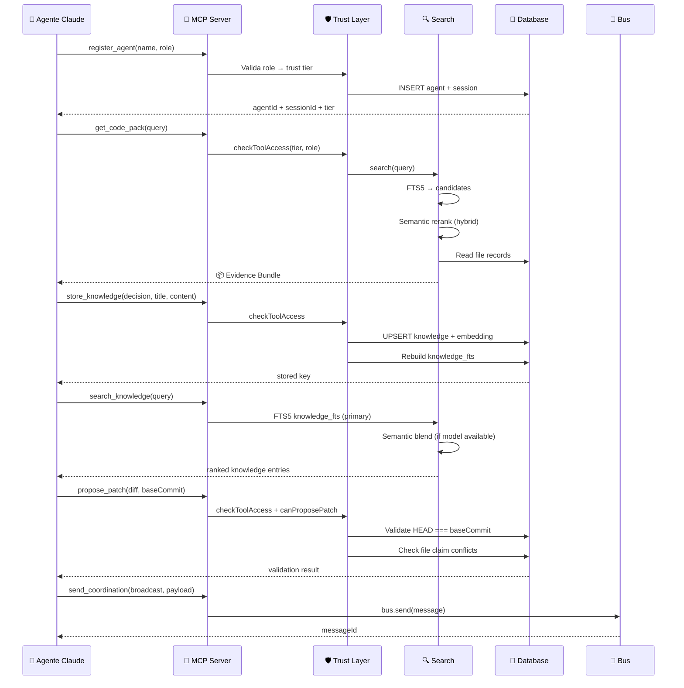
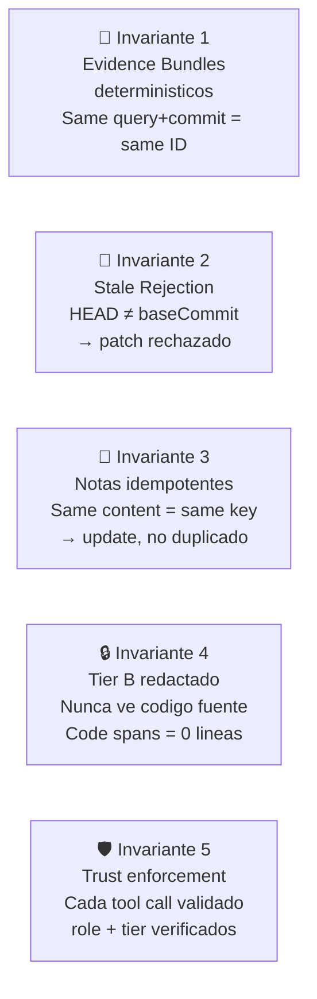

# Agora v1.0.0 — Arquitectura

## Diagrama General

```mermaid
flowchart TB
    subgraph CLI["🖥️ Comandos CLI"]
        init["⚡ agora init\nCrea .agora/ + config"]
        index["📇 agora index\nIndexa repo completo"]
        serve["🚀 agora serve\nInicia MCP + dashboard"]
        status["📊 agora status\nEstado del indice"]
        export["📤 agora export\nExporta a Obsidian"]
    end

    serve --> SERVER
    serve --> DASH

    subgraph SERVER["🔌 MCP Server — stdio o HTTP"]
        CTX["🧠 AgoraContext\nConfig + DB + SearchRouter\n+ CoordinationBus + InsightStream"]
    end

    CTX --> TOOLS

    subgraph TOOLS["🛠️ 22 Herramientas MCP"]
        read["📖 Lectura\nstatus · capabilities · schema\nget_code_pack · get_change_pack\nget_issue_pack"]
        agent["🤖 Agentes\nregister_agent · agent_status\nbroadcast · claim_files"]
        coord["🔗 Coordinacion\nsend_coordination\npoll_coordination"]
        patch["🩹 Parches\npropose_patch\nlist_patches"]
        note["📝 Notas\npropose_note\nlist_notes"]
        know["🧬 Conocimiento\nstore · search · query\narchive · delete"]
        reindex["🔄 request_reindex"]
    end

    TOOLS --> TRUST

    subgraph TRUST["🛡️ Capa de Seguridad"]
        tierA["🟢 Tier A — Acceso completo\nCodigo fuente + code spans"]
        tierB["🔴 Tier B — Acceso redactado\nSin codigo fuente"]
        roles["👤 Roles\n🔧 developer — todo permitido\n🔍 reviewer — notas limitadas\n👁️ observer — solo lectura\n⚙️ admin — acceso total"]
        secrets["🔒 Secret Scanner\nDetecta .env, .key, .pem\ncredentials, API keys"]
    end

    read --> SEARCH

    subgraph SEARCH["🔍 Sistema de Busqueda"]
        router["🎯 SearchRouter\nOrquesta los backends"]
        fts5["📚 FTS5 Backend — Codigo\nBM25: path=1.5× summary=1× symbols=2×\nAND semantics · scope filter\nTest penalty 0.7× · Config penalty 0.5×"]
        kfts5["📚 FTS5 Backend — Knowledge\nknowledge_fts virtual table\nBM25: title=3× content=1× tags=2×\nSiempre disponible (sin modelo)"]
        zoekt["🔎 Zoekt Backend\nMotor de busqueda de codigo\nOpcional"]
        semantic["🧠 Semantic Reranker\nONNX · MiniLM-L6-v2\n384 dimensiones · cosine sim"]
        hybrid["⚗️ Hybrid Search\nalpha=0.5 — FTS5 ∪ Vector\nMejor recall que FTS5 solo"]
        router --> fts5
        router --> kfts5
        router --> zoekt
        fts5 --> hybrid
        semantic --> hybrid
    end

    SEARCH --> EVIDENCE

    subgraph EVIDENCE["📦 Evidence Bundles — Paquetes de Contexto"]
        stageA["🅰️ Stage A — Candidatos\nTop 5 resultados de busqueda\npath + symbols + score + summary"]
        stageB["🅱️ Stage B — Expansion\nTop 3 expandidos con:\n· Code spans de 200 lineas\n· Commits relacionados\n· Notas vinculadas\n· Deteccion de secretos"]
        bid["🔑 bundleId Deterministico\nSHA-256 de query+commit+paths\nMismo input = mismo bundle"]
        stageA --> stageB --> bid
    end

    reindex --> INDEXING

    subgraph INDEXING["📇 Pipeline de Indexacion"]
        git["🌿 Git\nLee HEAD · lista archivos\nDetecta cambios incrementales"]
        parser["🌳 Tree-sitter Parser\nTypeScript · JavaScript\nPython · Go · Rust"]
        syms["🏷️ Extraccion de Simbolos\nfunction · class · method\ntype · variable · import/export"]
        summ["📋 Generador de Resumen\nDescripcion breve por archivo"]
        emb["🧲 Generador de Embeddings\n384-dim float32 vectors\nPara busqueda semantica"]

        git --> parser
        parser --> syms
        parser --> summ
        parser --> emb
    end

    coord --> BUS

    subgraph BUS["📡 Bus de Coordinacion"]
        types["💬 6 Tipos de Mensaje\ntask_claim · task_release\npatch_intent · conflict_alert\nstatus_update · broadcast"]
        topo["🌐 Topologias\nhub-spoke — visibilidad central\nhybrid — mesh selectivo\nmesh — todos ven todo"]
        cap["📝 200 mensajes max en memoria\nNo persistidos en DB"]
    end

    subgraph DATA["💾 Capa de Datos"]
        repodb["📦 Repo DB — .agora/agora.db\n─────────────────────\n📁 files + imports\n🤖 agents + sessions\n📝 notes\n🩹 patches\n📊 event_logs + debug_payloads\n🧬 knowledge scope=repo\n🔍 files_fts FTS5 virtual table\n🔍 knowledge_fts FTS5 virtual table"]
        globaldb["🌐 Global DB — ~/.agora/knowledge.db\n─────────────────────\n🧬 knowledge scope=global\n🔍 knowledge_fts FTS5 virtual table\nCompartido entre proyectos\nDecisiones cross-repo"]
    end

    INDEXING --> repodb
    TRUST --> DATA
    know --> globaldb

    subgraph DASH["📊 Dashboard Command Center — puerto 3141"]
        html["🎨 UI Dark Theme\nLayered surfaces\nAnimated pulse SSE indicator"]
        api["🔌 REST API\n/api/overview · /api/agents\n/api/logs · /api/patches\n/api/notes · /api/knowledge"]
        sse["📡 Server-Sent Events\n7 tipos de eventos en tiempo real\nagent_registered · session_changed\npatch_proposed · note_added\nevent_logged · index_updated\nknowledge_stored"]
        charts["📈 SVG Charts — Zero deps\n🍩 Donut: uso de tools\n🍩 Donut: estados de patches\n📊 Bars: tipos de knowledge\n📉 Sparkline: actividad 24h"]
        tabs["🗂️ 5 Tabs con contadores\nAgents · Activity Log\nPatches · Notes · Knowledge"]
    end

    DASH --> DATA

    subgraph OBSIDIAN["📓 Export a Obsidian"]
        vault["🗂️ Estructura del Vault\nAgora/decision/*.md\nAgora/gotcha/*.md\nAgora/pattern/*.md\nAgora/context/*.md\nAgora/plan/*.md\nAgora/solution/*.md"]
        fm["📋 YAML Frontmatter\ntype · scope · key · status\ntags · agentId · dates"]
        slug["🔤 Slugify\ntitulo → nombre-de-archivo.md\nMax 100 chars, URL-safe"]
    end

    export --> OBSIDIAN
    OBSIDIAN --> DATA

    subgraph LOGGING["📊 Auditoria"]
        events["📝 Event Log\neventId · agentId · tool\ntimestamp · durationMs · status\npayloadSize · redactedSummary"]
        debug["🔬 Debug Payloads\nrawInput + rawOutput\nSecret-redacted · TTL 24h\nSolo con --debug-logging"]
        insight["💡 InsightStream\nquiet · normal · verbose\nSalida a stderr"]
    end

    TOOLS --> LOGGING
    LOGGING --> repodb
```

## Flujo de Datos: Agente → Contexto → Accion

```mermaid
sequenceDiagram
    participant A as 🤖 Agente Claude
    participant M as 🔌 MCP Server
    participant T as 🛡️ Trust Layer
    participant S as 🔍 Search
    participant D as 💾 Database
    participant B as 📡 Bus

    A->>M: register_agent(name, role)
    M->>T: Valida role → trust tier
    T->>D: INSERT agent + session
    D-->>A: agentId + sessionId + tier

    A->>M: get_code_pack(query)
    M->>T: checkToolAccess(tier, role)
    T->>S: search(query)
    S->>S: FTS5 → candidates
    S->>S: Semantic rerank (hybrid)
    S->>D: Read file records
    S-->>A: 📦 Evidence Bundle

    A->>M: store_knowledge(decision, title, content)
    M->>T: checkToolAccess
    T->>D: UPSERT knowledge + embedding
    T->>D: Rebuild knowledge_fts
    D-->>A: stored key

    A->>M: search_knowledge(query)
    M->>S: FTS5 knowledge_fts (primary)
    S->>S: Semantic blend (if model available)
    S-->>A: ranked knowledge entries

    A->>M: propose_patch(diff, baseCommit)
    M->>T: checkToolAccess + canProposePatch
    T->>D: Validate HEAD === baseCommit
    T->>D: Check file claim conflicts
    D-->>A: validation result

    A->>M: send_coordination(broadcast, payload)
    M->>B: bus.send(message)
    B-->>A: messageId
```

## Modelo de Conocimiento

```mermaid
flowchart LR
    subgraph TYPES["🧬 7 Tipos de Conocimiento"]
        decision["🎯 decision\nElecciones arquitecturales"]
        gotcha["⚠️ gotcha\nTrampas y errores comunes"]
        pattern["🔄 pattern\nPatrones recurrentes"]
        context["📖 context\nComo funciona algo"]
        plan["📋 plan\nPlanes de implementacion"]
        solution["✅ solution\nSoluciones a problemas"]
        preference["⭐ preference\nPreferencias del usuario"]
    end

    subgraph SCOPE["🌍 2 Scopes"]
        repo["📦 repo\n.agora/agora.db\nLocal al proyecto"]
        global["🌐 global\n~/.agora/knowledge.db\nCompartido cross-project"]
    end

    subgraph OPS["⚡ 5 Operaciones"]
        store["💾 store\nUpsert + embedding + rebuild FTS"]
        search["🔍 search\nFTS5 primary + semantic blend"]
        query["📋 query\nSQL: type, tags, status"]
        archive["📦 archive\nSoft delete + rebuild FTS"]
        delete["🗑️ delete\nHard delete + rebuild FTS"]
    end

    TYPES --> SCOPE
    SCOPE --> OPS
```

## Invariantes del Sistema

```mermaid
flowchart LR
    I1["🔑 Invariante 1\nEvidence Bundles\ndeterministicos\nSame query+commit = same ID"]
    I2["🚫 Invariante 2\nStale Rejection\nHEAD ≠ baseCommit\n→ patch rechazado"]
    I3["📝 Invariante 3\nNotas idempotentes\nSame content = same key\n→ update, no duplicado"]
    I4["🔒 Invariante 4\nTier B redactado\nNunca ve codigo fuente\nCode spans = 0 lineas"]
    I5["🛡️ Invariante 5\nTrust enforcement\nCada tool call validado\nrole + tier verificados"]
```
