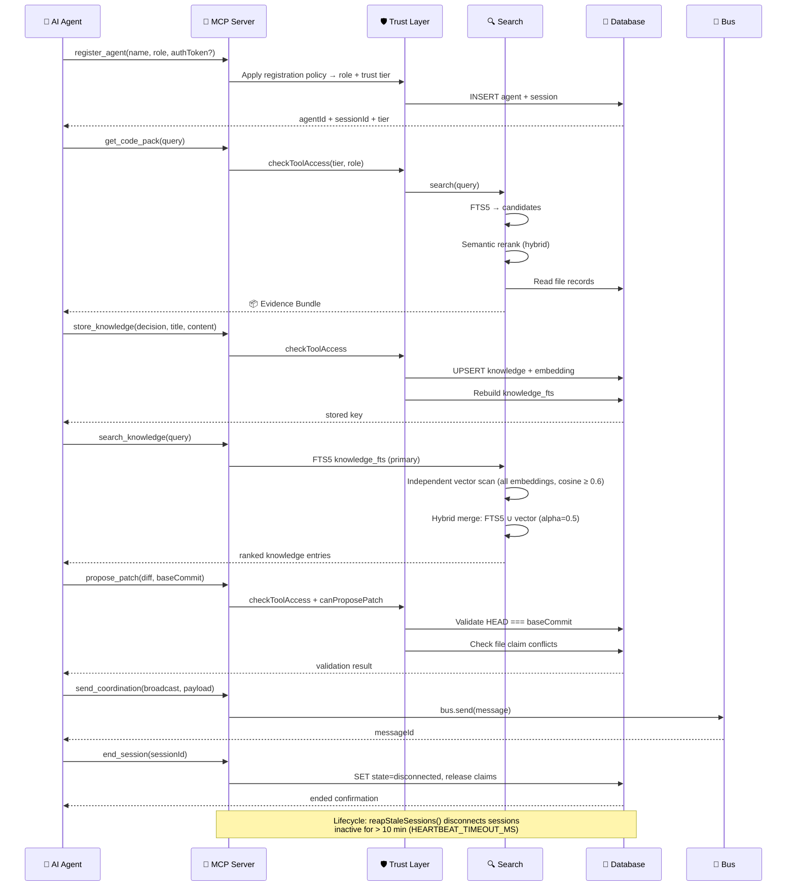
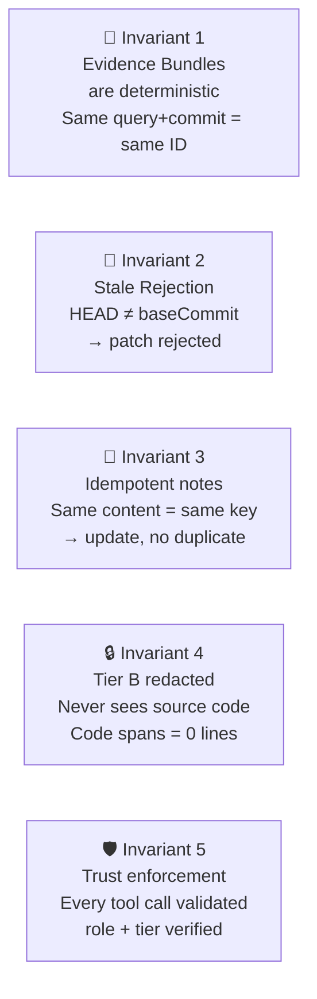

# Agora v1.0.0 — Architecture

## System Overview

```mermaid
flowchart TB
    subgraph CLI["🖥️ CLI Commands"]
        init["⚡ agora init\nCreate .agora/ + config"]
        index["📇 agora index\nFull repo index"]
        serve["🚀 agora serve\nStart MCP + dashboard"]
        status["📊 agora status\nIndex status"]
        export["📤 agora export\nExport to Obsidian"]
    end

    serve --> SERVER
    serve --> DASH

    subgraph SERVER["🔌 MCP Server — stdio or HTTP"]
        CTX["🧠 AgoraContext\nConfig + DB + SearchRouter\n+ CoordinationBus + InsightStream"]
    end

    CTX --> TOOLS

    subgraph TOOLS["🛠️ 23 MCP Tools"]
        read["📖 Read\nstatus · capabilities · schema\nget_code_pack · get_change_pack\nget_issue_pack"]
        agent["🤖 Agents\nregister_agent · agent_status\nbroadcast · claim_files · end_session"]
        coord["🔗 Coordination\nsend_coordination\npoll_coordination"]
        patch["🩹 Patches\npropose_patch\nlist_patches"]
        note["📝 Notes\npropose_note\nlist_notes"]
        know["🧬 Knowledge\nstore · search · query\narchive · delete"]
        reindex["🔄 request_reindex"]
    end

    TOOLS --> TRUST

    subgraph TRUST["🛡️ Security Layer"]
        tierA["🟢 Tier A — Full access\nSource code + code spans"]
        tierB["🔴 Tier B — Redacted access\nNo source code"]
        roles["👤 Roles\n🔧 developer — full access\n🔍 reviewer — limited notes\n👁️ observer — read-only\n⚙️ admin — full access"]
        secrets["🔒 Secret Scanner\nDetects .env, .key, .pem\ncredentials, API keys"]
    end

    read --> SEARCH

    subgraph SEARCH["🔍 Search System"]
        router["🎯 SearchRouter\nOrchestrates backends"]
        fts5["📚 FTS5 Backend — Code\nBM25: path=1.5× summary=1× symbols=2×\nAND semantics · scope filter\nTest penalty 0.7× · Config penalty 0.5×"]
        kfts5["📚 FTS5 Backend — Knowledge\nknowledge_fts virtual table\nBM25: title=3× content=1× tags=2×\nAlways available (no model required)"]
        zoekt["🔎 Zoekt Backend\nCode search engine\nOptional"]
        semantic["🧠 Semantic Reranker\nONNX · MiniLM-L6-v2\n384 dimensions · cosine sim"]
        hybrid["⚗️ Hybrid Search\nalpha=0.5 — FTS5 ∪ Vector\nBetter recall than FTS5 alone"]
        router --> fts5
        router --> kfts5
        router --> zoekt
        fts5 --> hybrid
        semantic --> hybrid
    end

    SEARCH --> EVIDENCE

    subgraph EVIDENCE["📦 Evidence Bundles — Context Packages"]
        stageA["🅰️ Stage A — Candidates\nTop 10 search results\npath + symbols + score + summary"]
        stageB["🅱️ Stage B — Expansion\nTop 5 expanded with:\n· Code spans up to 200 lines\n· Related commits\n· Linked notes\n· Secret detection"]
        bid["🔑 Deterministic bundleId\nSHA-256 of query+commit+paths\nSame input = same bundle"]
        stageA --> stageB --> bid
    end

    reindex --> INDEXING

    subgraph INDEXING["📇 Indexing Pipeline"]
        git["🌿 Git\nReads HEAD · lists files\nDetects incremental changes"]
        parser["🌳 Tree-sitter Parser\nTypeScript · JavaScript\nPython · Go · Rust"]
        syms["🏷️ Symbol Extraction\nfunction · class · method\ntype · variable · import/export"]
        summ["📋 Summary Generator\nBrief description per file"]
        emb["🧲 Embedding Generator\n384-dim float32 vectors\nFor semantic search"]

        git --> parser
        parser --> syms
        parser --> summ
        parser --> emb
    end

    coord --> BUS

    subgraph BUS["📡 Coordination Bus"]
        types["💬 6 Message Types\ntask_claim · task_release\npatch_intent · conflict_alert\nstatus_update · broadcast"]
        topo["🌐 Topologies\nhub-spoke — central visibility\nhybrid — selective mesh\nmesh — all see all"]
        cap["📝 200 messages max in memory\nNot persisted to DB"]
    end

    subgraph DATA["💾 Data Layer"]
        repodb["📦 Repo DB — .agora/agora.db\n─────────────────────\n📁 files + imports\n🤖 agents + sessions\n📝 notes\n🩹 patches\n📊 event_logs + debug_payloads\n🧬 knowledge scope=repo\n🔍 files_fts FTS5 virtual table\n🔍 knowledge_fts FTS5 virtual table"]
        globaldb["🌐 Global DB — ~/.agora/knowledge.db\n─────────────────────\n🧬 knowledge scope=global\n🔍 knowledge_fts FTS5 virtual table\nShared across projects\nCross-repo decisions"]
    end

    INDEXING --> repodb
    TRUST --> DATA
    know --> globaldb

    subgraph DASH["📊 Dashboard Command Center — port 3141"]
        html["🎨 Dark Theme UI\nLayered surfaces\nAnimated pulse SSE indicator"]
        api["🔌 REST API\n/api/overview · /api/agents\n/api/logs · /api/patches\n/api/notes · /api/knowledge"]
        sse["📡 Server-Sent Events\n7 real-time event types\nagent_registered · session_changed\npatch_proposed · note_added\nevent_logged · index_updated\nknowledge_stored"]
        charts["📈 SVG Charts — Zero deps\n🍩 Donut: tool usage\n🍩 Donut: patch states\n📊 Bars: knowledge types\n📉 Sparkline: 24h activity"]
        tabs["🗂️ 5 Tabs with counters\nAgents · Activity Log\nPatches · Notes · Knowledge"]
    end

    DASH --> DATA

    subgraph OBSIDIAN["📓 Obsidian Export"]
        vault["🗂️ Vault Structure\nAgora/decision/*.md\nAgora/gotcha/*.md\nAgora/pattern/*.md\nAgora/context/*.md\nAgora/plan/*.md\nAgora/solution/*.md"]
        fm["📋 YAML Frontmatter\ntype · scope · key · status\ntags · agentId · dates"]
        slug["🔤 Slugify\ntitle → file-name.md\nMax 100 chars, URL-safe"]
    end

    export --> OBSIDIAN
    OBSIDIAN --> DATA

    subgraph LOGGING["📊 Audit"]
        events["📝 Event Log\neventId · agentId · tool\ntimestamp · durationMs · status\npayloadSize · redactedSummary"]
        debug["🔬 Debug Payloads\nrawInput + rawOutput\nSecret-redacted · TTL 24h\nOnly with --debug-logging"]
        insight["💡 InsightStream\nquiet · normal · verbose\nOutput to stderr"]
    end

    TOOLS --> LOGGING
    LOGGING --> repodb
```

## Data Flow: Agent → Context → Action

```mermaid
sequenceDiagram
    participant A as 🤖 AI Agent
    participant M as 🔌 MCP Server
    participant T as 🛡️ Trust Layer
    participant S as 🔍 Search
    participant D as 💾 Database
    participant B as 📡 Bus

    A->>M: register_agent(name, role, authToken?)
    M->>T: Apply registration policy → role + trust tier
    T->>D: INSERT agent + session
    D-->>A: agentId + sessionId + tier

    A->>M: get_code_pack(query)
    M->>T: checkToolAccess(tier, role)
    T->>S: search(query)
    S->>S: FTS5 → candidates
    S->>S: Semantic rerank (hybrid)
    S->>D: Read file records
    S-->>A: 📦 Evidence Bundle

    A->>M: store_knowledge(decision, title, content)
    M->>T: checkToolAccess
    T->>D: UPSERT knowledge + embedding
    T->>D: Rebuild knowledge_fts
    D-->>A: stored key

    A->>M: search_knowledge(query)
    M->>S: FTS5 knowledge_fts (primary)
    S->>S: Independent vector scan (all embeddings, cosine ≥ 0.6)
    S->>S: Hybrid merge: FTS5 ∪ vector (alpha=0.5)
    S-->>A: ranked knowledge entries

    A->>M: propose_patch(diff, baseCommit)
    M->>T: checkToolAccess + canProposePatch
    T->>D: Validate HEAD === baseCommit
    T->>D: Check file claim conflicts
    D-->>A: validation result

    A->>M: send_coordination(broadcast, payload)
    M->>B: bus.send(message)
    B-->>A: messageId

    A->>M: end_session(sessionId)
    M->>D: SET state=disconnected, release claims
    D-->>A: ended confirmation

    Note over M,D: Lifecycle: reapStaleSessions() disconnects sessions<br/>inactive for > 10 min (HEARTBEAT_TIMEOUT_MS)
```

## Knowledge Model

```mermaid
flowchart LR
    subgraph TYPES["🧬 7 Knowledge Types"]
        decision["🎯 decision\nArchitectural choices"]
        gotcha["⚠️ gotcha\nCommon traps and pitfalls"]
        pattern["🔄 pattern\nRecurring patterns"]
        context["📖 context\nHow something works"]
        plan["📋 plan\nImplementation plans"]
        solution["✅ solution\nProblem solutions"]
        preference["⭐ preference\nUser preferences"]
    end

    subgraph SCOPE["🌍 2 Scopes"]
        repo["📦 repo\n.agora/agora.db\nLocal to project"]
        global["🌐 global\n~/.agora/knowledge.db\nShared cross-project"]
    end

    subgraph OPS["⚡ 5 Operations"]
        store["💾 store\nUpsert + embedding + rebuild FTS"]
        search["🔍 search\nFTS5 + independent vector scan\nHybrid merge (alpha=0.5)"]
        query["📋 query\nSQL: type, tags, status"]
        archive["📦 archive\nSoft delete + rebuild FTS"]
        delete["🗑️ delete\nHard delete + rebuild FTS"]
    end

    TYPES --> SCOPE
    SCOPE --> OPS
```

## System Invariants

```mermaid
flowchart LR
    I1["🔑 Invariant 1\nEvidence Bundles\nare deterministic\nSame query+commit = same ID"]
    I2["🚫 Invariant 2\nStale Rejection\nHEAD ≠ baseCommit\n→ patch rejected"]
    I3["📝 Invariant 3\nIdempotent notes\nSame content = same key\n→ update, no duplicate"]
    I4["🔒 Invariant 4\nTier B redacted\nNever sees source code\nCode spans = 0 lines"]
    I5["🛡️ Invariant 5\nTrust enforcement\nEvery tool call validated\nrole + tier verified"]
```
