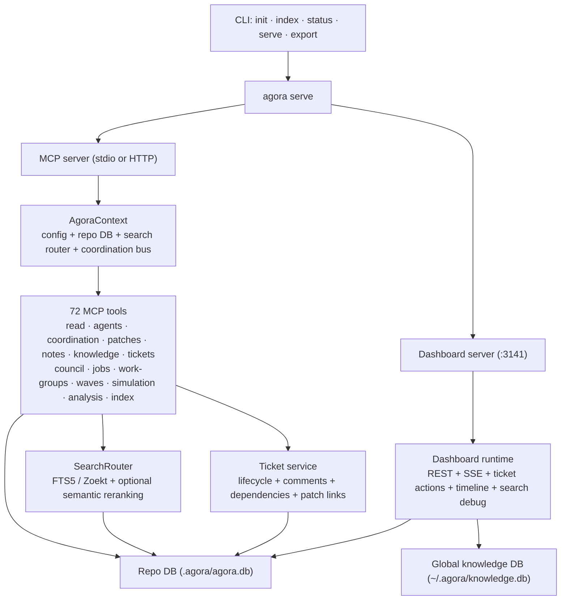
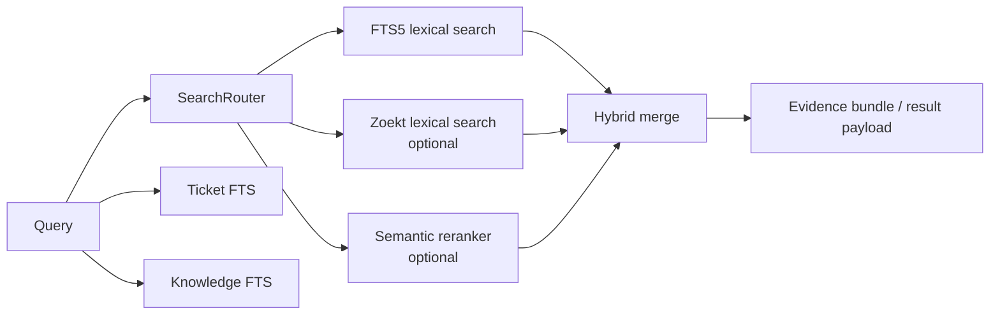
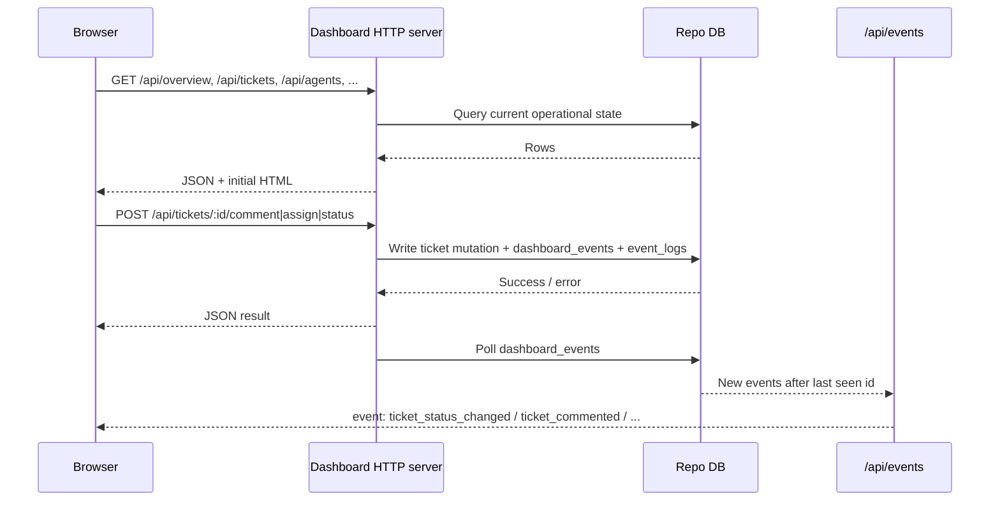

# Agora v1.0.0 — Architecture

## System Overview

## Runtime Shape

Agora runs as a local CLI with two main long-lived surfaces:

- MCP server for agent tools, over `stdio` or HTTP (`/mcp`)
- dashboard server for human visibility and local ticket actions

When `agora serve --transport http` starts, it creates:

- a repo-local SQLite database in `.agora/agora.db`
- a `SearchRouter` with FTS5 always available, Zoekt optional, semantic reranking optional
- a DB-backed `CoordinationBus`
- a dashboard server with REST routes and `/api/events` SSE

The dashboard is not a separate product tier. It is another local runtime surface over the same repo database.

## Tool Surface

The current tool surface (72 tools) is organized as:

- Read: `status`, `capabilities`, `schema`, `get_code_pack`, `get_change_pack`, `get_issue_pack`, `search_remote_instances`
- Agents and coordination: `register_agent`, `agent_status`, `broadcast`, `send_coordination`, `poll_coordination`, `claim_files`, `end_session`, `spawn_agent`
- Patches and notes: `propose_patch`, `list_patches`, `propose_note`, `list_notes`
- Knowledge: `store_knowledge`, `search_knowledge`, `query_knowledge`, `archive_knowledge`, `delete_knowledge`
- Tickets: `create_ticket`, `assign_ticket`, `update_ticket_status`, `update_ticket`, `list_tickets`, `search_tickets`, `get_ticket`, `comment_ticket`, `link_tickets`, `unlink_tickets`, `prune_stale_relations`
- Council and governance: `assign_council`, `submit_verdict`, `check_consensus`, `list_verdicts`
- Analysis: `analyze_complexity`, `analyze_test_coverage`, `analyze_coupling`, `find_dependency_cycles`, `suggest_actions`, `suggest_next_work`, `lookup_dependencies`, `find_references`, `trace_dependencies`
- Protection: `add_protected_artifact`, `remove_protected_artifact`, `list_protected_artifacts`
- Workflows: `run_workflow`, `decompose_goal`
- Jobs: `create_loop`, `list_jobs`, `claim_job`, `update_job_progress`, `complete_job`, `release_job`
- Work groups: `create_work_group`, `update_work_group`, `add_tickets_to_group`, `remove_tickets_from_group`, `list_work_groups`
- Waves: `compute_waves`, `launch_convoy`, `advance_wave`, `get_wave_status`
- Simulation: `run_simulation`, `run_optimization`
- Index: `request_reindex`
- Export: `export_audit`

Role access and session requirements are policy-driven. Some tools are public, some require an active session, and some require both session ownership and role access. Tool-level rate limiting is enforced per agent/session.

## Data Model

### Repo DB

The repo database holds operational state for the current repository:

- source index: `files`, `imports`, `code_chunks`, `symbol_references`, `files_fts`, `index_state`
- agents and sessions: `agents`, `sessions`, `roles`
- collaboration: `coordination_messages`, `event_logs`, `debug_payloads`
- notes and patches: `notes`, `patches`
- knowledge: `knowledge`, `knowledge_fts`
- tickets: `tickets`, `ticket_history`, `ticket_comments`, `ticket_dependencies`, `tickets_fts`
- governance: `review_verdicts`, `council_assignments`
- work groups: `work_groups`, `work_group_tickets`
- jobs: `job_slots`
- concurrency: `commit_locks`
- protection: `protected_artifacts`
- dashboard event stream: `dashboard_events`

### Global DB

The global database is narrower:

- cross-project `knowledge`
- `knowledge_fts`

It is used for global decisions, patterns, and other reusable knowledge outside a single repo.

## Search Architecture

There are now three search subsystems:

- code search: lexical backend plus optional semantic merge
- knowledge search: FTS5 plus optional semantic merge
- ticket search: FTS5 over ticket metadata

The dashboard search debugger exposes the code-search runtime path and shows:

- runtime backend
- lexical backend actually used for keyword candidates
- sanitized FTS query when lexical backend is FTS5
- lexical, semantic, and merged result buckets

## Ticket Runtime

Tickets are first-class operational records, not knowledge entries.

Core records:

- `tickets`: current state and ownership
- `ticket_history`: authoritative status transition log
- `ticket_comments`: discussion and technical analysis
- `ticket_dependencies`: `blocks` and `relates_to` edges

Patch linkage is stored by `patches.ticket_id -> tickets.id`.

Current workflow states:

- `backlog`
- `technical_analysis`
- `approved`
- `in_progress`
- `in_review`
- `ready_for_commit`
- `blocked`
- `resolved`
- `closed`
- `wont_fix`

Assignment is ownership metadata, not its own workflow state.

## Dashboard Runtime

The dashboard currently exposes:

- overview stats
- live agents
- activity charts
- indexed-file metrics
- agent timeline
- search debugger
- activity log
- patches
- notes
- knowledge
- tickets with table/board views, detail, comments, and local actions

Realtime updates are driven from persisted `dashboard_events`, not only in-memory broadcast.

### Security Model

The dashboard binds to `localhost` and assumes a **localhost trust model**: any process on the local machine can reach the HTTP API. This is intentional for the current use case (single-developer, local-first tooling).

What the dashboard does enforce:

- **Input validation**: all POST endpoints validate request bodies through Zod schemas (same constraints as the MCP tool layer) and reject malformed input with structured 400 errors.
- **Security headers**: CSP, X-Frame-Options DENY, nosniff, CORS restricted to localhost origin.
- **Body size limit**: request bodies are capped at 1 MB.
- **Role and session checks**: ticket mutations go through the same `authorizeTicketActor` path as MCP tools, requiring a valid agent session.

What the dashboard does not enforce:

- **Authentication**: no bearer token or API key is required. Localhost reachability is the trust boundary.
- **CSRF protection**: POST endpoints do not check Origin headers beyond CORS preflight.

If the dashboard is ever exposed beyond localhost (reverse proxy, tunneling), authentication and CSRF protection should be added before that change ships.

## Coordination and Audit

Coordination messages and dashboard events are persisted in the repo DB, which gives:

- cross-session visibility
- durable dashboard refresh sources
- replayable operational history

Runtime event logging is separate from ticket history:

- `event_logs` captures tool usage metadata and outcomes
- `ticket_history` captures workflow transitions
- `ticket_comments` captures analysis and human/agent discussion

## Governance & Council Review

Ticket advancement through gated transitions (e.g., `in_review` → `ready_for_commit`) requires quorum-based council approval:

- **Council assignments**: Each ticket gets specialized reviewers (security, architecture, testing, performance, documentation) via `assign_council`
- **Verdicts**: Reviewers submit approve/reject/abstain verdicts via `submit_verdict`. Verdicts are append-only with supersession tracking (`superseded_by` column)
- **Consensus**: `check_consensus` evaluates whether quorum requirements are met based on governance config (minimum votes, required specializations, model diversity)
- **Governance config**: Configurable in `.agora/config.json` — quorum size, required specializations, strict model diversity, auto-advance rules

The council-loop workflow automates evidence gathering, reviewer dispatch, and verdict collection for gated transitions.

## Wave Orchestration & Convoys

Waves enable parallel execution of independent tickets:

- **Wave computation**: `compute_waves` analyzes ticket dependency graphs and groups independent tickets into numbered waves
- **Convoy model**: `launch_convoy` creates a work group with wave plan, integration branch, and spawns agents per ticket
- **Wave advancement**: `advance_wave` checks wave completion and promotes the next wave's tickets
- **Integration branches**: Each convoy gets a dedicated branch for coordinated merges via `createConvoyWorktree`

Lifecycle: `launch_convoy` → per-ticket agents work in worktrees → `advance_wave` checks completion → next wave starts → convoy completes when all waves done.

## Job Board

Loop-based workforce management for multi-agent orchestration:

- **Loops**: Created via `create_loop` with a template (dev, council, plan) defining slot count and roles
- **Slots**: Each loop has typed job slots (developer, reviewer, planner) with specialization labels
- **Lifecycle**: `open` → `claimed` (agent takes slot) → `active` (work started) → `completed`/`released`
- **Heartbeats**: Active slots track `lastHeartbeat` for stale detection
- **Orchestrator**: `agora orchestrate` manages the full lifecycle — spawning agents, assigning tickets, handling failures with retry/failover chains

## Simulation Framework

Multi-phase simulation for testing workflows without side effects:

- **Phases A→E**: Progressive complexity from basic ticket creation through full council review and wave orchestration
- **Runner**: Simulates ticket lifecycle transitions with configurable timing and failure injection
- **Optimization**: `run_optimization` tests parameter variations (quorum sizes, timeouts) and reports optimal configurations

## Design Boundaries

A few important product boundaries are intentional:

- ticket progression should come from explicit agent actions and review, not board drag-and-drop
- dashboard actions are local operational tools, not a replacement for MCP role semantics
- repo-local ticketing is the primary model; multi-repo and cross-instance federation remain future work
