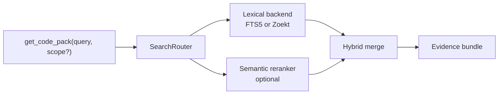
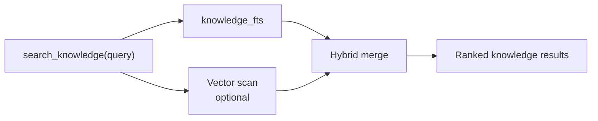

# Search Pipeline

Monsthera has three search paths built on the local repo database:

- code search for `get_code_pack`
- knowledge search for `search_knowledge`
- ticket search for `search_tickets`

Only code and knowledge search use semantic reranking. Ticket search is lexical FTS5 today.

## 1. Code Search

Code search is routed through `SearchRouter`.

### Lexical layer

Lexical candidates come from:

- `FTS5Backend` by default
- `ZoektBackend` when enabled and available

`SearchRouter.searchLexical()` is the authoritative keyword stage. If Zoekt fails, the router falls back to FTS5.

### Semantic layer

If semantic search is enabled and the MiniLM model loads successfully:

- the reranker generates an embedding for the query
- vector search runs against indexed file embeddings
- file vector search is an `O(n)` linear scan over embedded files in the repo today
- lexical and vector results are merged with `alpha=0.5`

If semantic initialization fails, code search remains available via lexical search only.

Monsthera does not maintain an ANN structure yet. If repository size or query latency makes linear scans a problem, the next step should be an explicit ANN layer evaluation rather than hiding the limitation.

### Scope filtering

The optional `scope` parameter narrows results to a path prefix.

- lexical filtering happens at the backend query layer
- semantic filtering is applied to vector results before merge

### Evidence bundle expansion

The merged candidate list feeds `buildEvidenceBundle()`:

- stage A: candidate files with paths, summaries, symbols, and scores
- stage B: top files expanded into code spans, related commits, and linked notes
- secret redaction applied to code spans when needed

## 2. Code Search Debugger

The dashboard exposes `/api/search/debug`, which is a read-only inspection surface over code search.

It shows:

- runtime backend, e.g. `fts5`, `fts5+semantic`, `zoekt`, `zoekt+semantic`
- lexical backend actually used for keyword candidates
- sanitized FTS query when the lexical backend is FTS5
- lexical results
- semantic results
- merged results

This matters because runtime backend and lexical backend are not always the same conceptual thing once fallback paths exist.

## 3. Knowledge Search

Knowledge search uses its own FTS5 table, `knowledge_fts`, over repo-local and global knowledge stores.

### Lexical ranking

Knowledge BM25 weights are tuned toward concise identifiers:

- `title`: 3.0
- `content`: 1.0
- `tags`: 2.0

### Semantic behavior

If the semantic model is available:

- vector search scans active knowledge embeddings
- knowledge vector search is also `O(n)` over active embedded entries
- vector-only discoveries are merged with FTS results

If semantic search is unavailable:

- knowledge search still works through FTS5 only

## 4. Ticket Search

Ticket search uses `tickets_fts`.

Indexed fields:

- `ticket_id`
- `title`
- `description`
- `tags`

Filter-only fields:

- `status`
- `severity`
- `assignee_agent_id`
- `repo_id`

BM25 weighting favors ticket identity and title:

- `ticket_id`: 2.5
- `title`: 3.0
- `description`: 1.0
- `tags`: 2.0

`search_tickets` is lexical only today. It supports structured narrowing by:

- `status`
- `severity`
- `assigneeAgentId`

Ticket FTS is rebuilt:

- during router initialization only when the indexed commit changed or the FTS row counts no longer match source tables
- on repo reindex
- after ticket mutations that change searchable content

## 5. Indexed Dependency Lookup

`lookup_dependencies` is not a text search tool, but it reuses indexed structure from the repo database.

It answers:

- what a file directly imports
- which indexed files import a given target path

This is read-only and works from the normalized `imports` table, without invoking lexical or semantic ranking.

## 6. Backend Selection Rules

Current code-search backend behavior:

- FTS5 is always available
- Zoekt is optional
- semantic reranking is optional

This means runtime search can be:

- `fts5`
- `fts5+semantic`
- `zoekt`
- `zoekt+semantic`

Ticket and knowledge FTS are SQLite-backed and do not depend on Zoekt.

## 7. Operational Notes

The search stack now interacts with more than retrieval:

- ticket mutations can trigger `rebuildTicketFts()`
- the dashboard search debugger depends on router wiring from `index.ts`
- indexed file metrics can surface secret scan hits from the file index

Search docs should therefore stay aligned with:

- `src/search/router.ts`
- `src/search/fts5.ts`
- `src/search/debug.ts`
- `src/retrieval/evidence-bundle.ts`
- `src/index.ts`

Current performance posture:

- startup now avoids redundant FTS rebuilds when repo index state already matches `HEAD` and the FTS row counts are current
- batched FTS rebuild reads are still deferred until repository scale shows the count-based fast path is no longer sufficient
- ANN/vector indexing remains a future optimization, not a hidden assumption in the current search path
