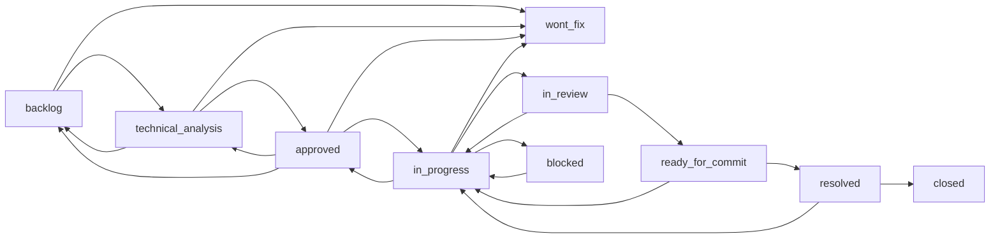

# Ticket Workflow

This document captures the working conventions around Agora tickets.

The state machine exists in code, but the human workflow matters just as much:

- when a ticket is still design work
- when it is ready to implement
- when implementation must stop
- when QA should reopen vs create a new follow-up ticket

## States

| State | Meaning | Typical actor |
|---|---|---|
| `backlog` | Captured but not yet shaped | reviewer / admin |
| `technical_analysis` | Problem framing, design discussion, tradeoffs | reviewer / admin |
| `approved` | Ready to implement with enough clarity | reviewer / admin |
| `in_progress` | An agent is actively implementing | developer |
| `in_review` | Implementation is done and waiting for QA or reviewer validation | developer hands off, reviewer validates |
| `ready_for_commit` | Review passed and the slice is approved to land | reviewer / admin |
| `blocked` | Cannot move because of dependency or missing input | developer / admin |
| `resolved` | Accepted as complete | reviewer / admin |
| `closed` | Fully finished and no further action expected | reviewer / admin |
| `wont_fix` | Explicitly not being pursued | reviewer / admin |

Assignment is not its own status. Ownership lives in `assigneeAgentId`.

## State Machine



## Canonical Handoff Rule

The most important convention is:

- implementation ends at `in_review`
- QA or reviewer decides what happens next

Recommended flow:

1. `technical_analysis`
2. `approved`
3. `in_progress`
4. `in_review`
5. `ready_for_commit`
6. `resolved`

This is partly social rather than perfectly enforced, so it must stay documented.

## Enforced Quorum Gates

Two workflow transitions are now enforced against council verdicts, not just documented:

- `technical_analysis -> approved`
- `in_review -> ready_for_commit`

Default enforcement rules:

- require `total council roles - 2` PASS verdicts
- `architect` and `security` FAIL verdicts act as vetoes
- `admin` remains the explicit bypass role

Operational flow:

1. reviewers submit structured verdicts via `submit_verdict`
2. anyone with access can inspect readiness via `check_consensus`
3. gated transitions fail with structured consensus details until quorum is satisfied

Repository-specific overrides live in `.agora/config.json` under `ticketQuorum`.

## QA Review Rules

When review finds a problem, choose between two paths:

### Reopen the same ticket

Move the ticket back to `in_progress` when:

- the issue is just unfinished work inside the same scope
- the intended acceptance criteria have not been met
- the fix belongs to the same implementation slice

### Open a follow-up bug ticket

Create a new ticket when:

- the bug is separable from the original slice
- it deserves its own priority or tracking
- it should not block acceptance of the original ticket directly

Practical rule:

- same scope rework -> back to `in_progress`
- distinct new defect -> new bug ticket, original can still progress independently

Administrative correction:

- use `in_progress -> approved` when a ticket was auto-started incorrectly and should return to the ready queue without being marked blocked
- use `approved -> technical_analysis` when an approval must be invalidated and sent back to council/design review

## Technical Analysis Convention

Technical planning belongs in ticket comments using a structured header like:

```text
[Technical Analysis]
Summary
Current State
Constraints
Proposed Approach
Implementation Slices
Verification Plan
Risks
Open Questions
Compound Output
```

Only propose a ticket for implementation after analysis and review converge.

## Consensus and Readiness

A ticket is considered implementation-ready when:

- scope is bounded
- major risks are identified
- dependencies are clear
- acceptance criteria are testable
- reviewers no longer have unresolved design objections

That is the point where `technical_analysis` should become `approved`.

## Dependencies

Agora supports ticket-to-ticket relationships:

- `blocks`
- `relates_to`

`blocks` edges are validated to avoid cycles.

Use them to express:

- sequencing constraints
- prerequisites
- parallel but related work

Do not use dependency links as a substitute for status transitions.

## Product Boundary

The board is a visibility tool, not an authoritative workflow engine.

That means:

- ticket status should move through explicit agent actions and review decisions
- not by free-form drag-and-drop board manipulation

This keeps the workflow auditable and tied to real implementation progress.
